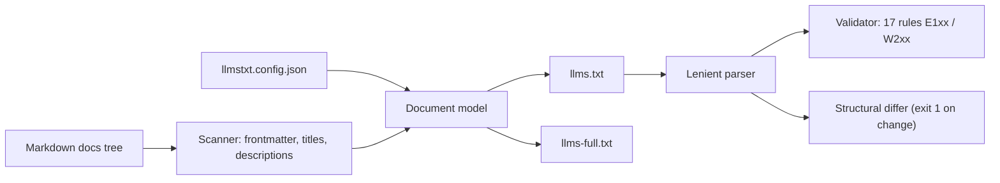

# llmstxt-kit

[English](README.md) | [中文](README.zh.md) | [日本語](README.ja.md)

[](LICENSE)   [](CONTRIBUTING.md)

**llms.txt 仕様のためのオープンソース・ツールチェーン——任意の Markdown ドキュメントツリーから llms.txt / llms-full.txt を生成・検証（lint）・比較（diff）。完全オフライン、依存ゼロ。**


```bash
# not yet on npm — install from a checkout of this repository
npm install && npm run build && npm pack
npm install -g ./llmstxt-kit-0.1.0.tgz
```

## なぜ llmstxt-kit なのか？

[llms.txt](https://llmstxt.org/) は AI 時代の robots.txt になりつつあります。サイトのルートに置く Markdown の索引で、LLM クローラーにドキュメントの内容と全文の所在を伝えるものです。既存ツールの多くはワークフローの一角しかカバーしません——リファレンス CLI の `llms_txt2ctx` は llms.txt を*消費*するだけで作成はせず、フレームワークのプラグインは自分のビルドの中でしか生成できず（VitePress、Docusaurus）、ホスティング型ジェネレーターは API キー経由でレンダリング済みサイトをクロールします。どれも、前の四半期に手書きしたファイルを検査してはくれず、デプロイ前に何が変わるのかも教えてくれません。llmstxt-kit は llms.txt をビルド成果物として扱い、完全なローカルツールチェーンを提供します。手元の Markdown から**生成**し、安定した規則コードと正確な行番号を持つ 17 のルールで**検証**し、2 つのバージョンを構造的に**比較**して、CI が索引の変更をコードのようにレビューできるようにします。

|  | llmstxt-kit | llms_txt2ctx | vitepress-plugin-llms | Firecrawl ジェネレーター |
|---|---|---|---|---|
| 入力 | 任意の Markdown ツリー | 既存の llms.txt | VitePress プロジェクトのみ | サイトのライブクロール |
| llms.txt / llms-full.txt の生成 | 可 / 可 | 不可 | 可 / 可 | 可 / 可 |
| llms.txt の lint（行レベル規則） | 17 ルール | 不可 | 不可 | 不可 |
| CI 向け構造 diff | 可 | 不可 | 不可 | 不可 |
| オフライン動作 | 可 | 可 | 可 | 不可（API + クレジット） |
| ランタイム依存 | 0 | Python + fastcore | VitePress ツールチェーン | ホスティングサービス |

<sub>依存関係・機能の記述は各プロジェクトの公開ドキュメントに照らして確認、2026-07。</sub>

## 特長

- **3 つの動詞、1 つのバイナリ** —— `generate`・`validate`・`diff` は同じパーサーと同じドキュメントモデルを共有し、linter とジェネレーターの判断が食い違うことはありません。
- **どんな Markdown ツリーでも入力に** —— フレームワークへのロックインなし。手元の `docs/` を指すだけ。frontmatter（`title`、`description`、`section`、`order`、`optional`、`draft`）で結果を調整できますが、必須項目は一つもありません。
- **安定コード付きの 17 の lint ルール** —— 仕様違反はエラー（E101–E108）、品質上の指摘は警告（W201–W209）。コードの意味は決して変わらないので、スクリプトで直接マッチできます。
- **テキストではなく構造の diff** —— 2 ファイル間のリンクを URL で対応付け。整形だけの変更は無音、実質的な変更は 1 件 1 行の接頭辞付きで報告し、終了コード 1 がそのまま CI に載ります。
- **決定的で誠実な出力** —— 同じツリー + 同じ設定はバイト単位で同一のファイルを生成し、生成されたファイルは必ず同梱バリデーターを指摘ゼロで通過します（テストで強制）。
- **ランタイム依存ゼロ、完全オフライン** —— 必要なのは Node.js だけ。ツールはソケットを一切開かず、devDependency は `typescript` のみです。

## クイックスタート

インストール：

```bash
# not yet on npm — install from a checkout of this repository
npm install && npm run build && npm pack
npm install -g ./llmstxt-kit-0.1.0.tgz
```

同梱のサンプルドキュメントツリーに対して生成と検証を実行：

```bash
# from the root of your checkout
cd examples
llmstxt generate --full
llmstxt validate llms.txt
```

出力（実際のキャプチャ）：

```text
llms.txt: 4 sections, 10 links -> llms.txt
llms-full.txt: 10 pages, 761 words -> llms-full.txt
llms.txt: OK (0 errors, 0 warnings)
```

生成された `llms.txt` の冒頭：

```text
# Brewlog

> A self-hosted coffee-brewing journal — every brew logged, charted and kept on your own machine.

## Getting started

- [Installation](https://example.test/docs/getting-started/installation.md): Brewlog ships as a single binary with no external services. Download the release for your platform, place it on your PATH, and you are done.
- [Quickstart](https://example.test/docs/getting-started/quickstart.md): Log your first brew in under two minutes.
```

続いて、ページを 1 つ改名し、もう 1 つを削除して再生成すると、デプロイで何が変わるのかが正確に見えます（実際のキャプチャ）：

```bash
# simulate the next deploy: rename one page's H1, delete another page
sed -i.bak 's/^# Quickstart$/# Fast start/' docs/getting-started/quickstart.md
rm docs/reference/glossary.md
llmstxt generate --out llms.new.txt --quiet
llmstxt diff llms.txt llms.new.txt
```

```text
llms.txt files differ: 2 changes
section "Getting started":
  ~ [Fast start](https://example.test/docs/getting-started/quickstart.md) title changed
section "Optional":
  - [Glossary](https://example.test/docs/reference/glossary.md)
```

`diff` は変更があると終了コード 1 で終わるため、2 行の CI ステップで llms.txt の更新にレビューを義務付けられます。その他のシナリオは [examples/](examples/README.md) へ。

## Lint ルール

エラー（E1xx）は llms.txt の構造違反、警告（W2xx）は品質上の指摘で `--strict` のときだけ失敗になります。各ルールの詳しい根拠は [docs/rules.md](docs/rules.md) を参照してください。

| ルール | 深刻度 | 検査内容 |
|---|---|---|
| E101–E104 | error | H1 はちょうど 1 つ・ファイル先頭・H3 以深の見出しなし |
| E105–E106 | error | セクション項目は `- [title](url)` リンクで、タイトルと URL が非空 |
| E107–E108 | error | セクション名の一意性、ファイルが空でないこと |
| W201, W207 | warning | 要約の引用ブロックが存在し、H1 の直下に置かれていること |
| W202, W208 | warning | セクションの中身はリンクであり、散文や空のセクションでないこと |
| W203, W205, W206 | warning | URL の重複なし、非 http(s) スキームなし、空の説明なし |
| W204 | warning | `Optional` セクションが最後にあること（コンテキスト切り詰めの起点） |
| W209 | warning | ファイルが改行で終わること |

## 設定

作業ディレクトリの `llmstxt.config.json` は自動で読み込まれます（`--config` でパスを上書き、フラグはファイルの値より優先）。未知のキーと型の誤りはハードエラー——タイプミスが黙って誤った索引を生むことはありません。

| キー | デフォルト | 効果 |
|---|---|---|
| `name` | ルート index の H1 | サイト名（H1） |
| `summary` | ルート index の最初の段落 | 引用ブロックの要約 |
| `baseUrl` | `""`（ルート相対） | すべてのリンク URL の接頭辞 |
| `docsDir` | `docs` | スキャンするドキュメントルート |
| `urlStyle` | `md` | `md` は `.md` を保持、`clean` は拡張子を除去、`html` は `.html` に変換 |
| `rootSection` | `Documentation` | ドキュメントルート直下のページのセクション名 |
| `sections` | `{}` | トップレベルディレクトリの改名、例 `{"api": "API reference"}` |
| `sectionOrder` | `[]` | セクション順を固定。残りはアルファベット順 |
| `optional` | `[]` | マッチした glob を `Optional` セクションへ |
| `exclude` | `[]` | マッチした glob を完全に除外 |
| `maxDescriptionLength` | `160` | 自動導出した説明の切り詰め長 |

終了コードは全サブコマンド共通：`0` 正常、`1` lint エラーまたは diff の変更、`2` 用法/設定/IO エラー——スクリプトが「ファイルが悪い」と「呼び出し方が悪い」を区別できます。

## アーキテクチャ



## ロードマップ

- [x] ジェネレーター（llms.txt + llms-full.txt）、17 ルールのバリデーター、構造 diff、厳格な設定ローダー、JSON 出力（v0.1.0）
- [ ] `check` コマンド：生成 + 比較を一度に実行する 1 行の CI ゲート
- [ ] `--fix` による自動修正（末尾改行、コロンの整理）
- [ ] MDX 入力と見出しアンカーリンクへの対応
- [ ] sitemap.xml / URL リスト入力による非 Markdown サイト対応

全リストは [open issues](https://github.com/JaydenCJ/llmstxt-kit/issues) を参照してください。

## コントリビュート

コントリビューション歓迎です。`npm install && npm run build` でビルドし、`npm test` と `bash scripts/smoke.sh`（`SMOKE OK` の出力が必須）を実行してください——このリポジトリは CI を同梱せず、上記の主張はすべてローカル実行で検証されています。[CONTRIBUTING.md](CONTRIBUTING.md) を読み、[good first issue](https://github.com/JaydenCJ/llmstxt-kit/issues?q=is%3Aissue+is%3Aopen+label%3A%22good+first+issue%22) を選ぶか、[discussion](https://github.com/JaydenCJ/llmstxt-kit/discussions) を始めてください。

## ライセンス

[MIT](LICENSE)
