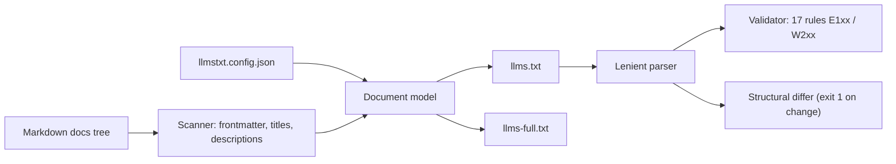

# llmstxt-kit

[English](README.md) | [中文](README.zh.md) | [日本語](README.ja.md)

[](LICENSE)   [](CONTRIBUTING.md)

**An open-source toolchain for the llms.txt spec — generate, lint and diff llms.txt and llms-full.txt from any Markdown docs tree, offline and dependency-free.**


```bash
# not yet on npm — install from a checkout of this repository
npm install && npm run build && npm pack
npm install -g ./llmstxt-kit-0.1.0.tgz
```

## Why llmstxt-kit?

[llms.txt](https://llmstxt.org/) is becoming the robots.txt of the AI era: a Markdown index at your site root that tells LLM crawlers what your docs contain and where the full text lives. Most existing tooling covers only one corner of the workflow — the reference `llms_txt2ctx` CLI *consumes* llms.txt but does not create it, framework plugins generate it but only inside their own build (VitePress, Docusaurus), and hosted generators crawl your rendered site through an API key. None of them lint the file you hand-wrote last quarter, and none of them tell you what changed before you deploy. llmstxt-kit treats llms.txt as a build artifact with a full local toolchain: **generate** from the Markdown you already have, **validate** with 17 stable-coded rules and exact line numbers, and **diff** two versions structurally so your CI can review index changes like code.

|  | llmstxt-kit | llms_txt2ctx | vitepress-plugin-llms | Firecrawl generator |
|---|---|---|---|---|
| Input | any Markdown tree | an existing llms.txt | VitePress projects only | live crawl of your site |
| Generates llms.txt / llms-full.txt | yes / yes | no | yes / yes | yes / yes |
| Lints llms.txt (line-level rules) | 17 rules | no | no | no |
| Structural diff for CI | yes | no | no | no |
| Works offline | yes | yes | yes | no (API + credits) |
| Runtime dependencies | 0 | Python + fastcore | VitePress toolchain | hosted service |

<sub>Dependency and capability claims checked against each project's public docs, 2026-07.</sub>

## Features

- **Three verbs, one binary** — `generate`, `validate` and `diff` share one parser and one document model, so the linter always agrees with the generator.
- **Any Markdown tree in** — no framework lock-in: point it at the `docs/` you already have; frontmatter (`title`, `description`, `section`, `order`, `optional`, `draft`) refines the result but nothing requires it.
- **17 lint rules with stable codes** — spec violations are errors (E101–E108), quality findings are warnings (W201–W209); codes never change meaning, so scripts can match on them.
- **Structural, not textual, diff** — links are matched by URL across two files; reformatting is silence, real changes are one prefixed line each, and exit code 1 makes it CI-ready.
- **Deterministic and honest output** — same tree + same config produces byte-identical files, and every generated file passes the bundled validator with zero findings (enforced by tests).
- **Zero runtime dependencies, fully offline** — Node.js is the only requirement; the tool never opens a socket, and `typescript` is the sole devDependency.

## Quickstart

Install:

```bash
# not yet on npm — install from a checkout of this repository
npm install && npm run build && npm pack
npm install -g ./llmstxt-kit-0.1.0.tgz
```

Generate and validate against the bundled example docs tree:

```bash
# from the root of your checkout
cd examples
llmstxt generate --full
llmstxt validate llms.txt
```

Output (real captured run):

```text
llms.txt: 4 sections, 10 links -> llms.txt
llms-full.txt: 10 pages, 761 words -> llms-full.txt
llms.txt: OK (0 errors, 0 warnings)
```

The first lines of the generated `llms.txt`:

```text
# Brewlog

> A self-hosted coffee-brewing journal — every brew logged, charted and kept on your own machine.

## Getting started

- [Installation](https://example.test/docs/getting-started/installation.md): Brewlog ships as a single binary with no external services. Download the release for your platform, place it on your PATH, and you are done.
- [Quickstart](https://example.test/docs/getting-started/quickstart.md): Log your first brew in under two minutes.
```

Now rename a page, delete another, regenerate and see exactly what your deploy would change (real captured run):

```bash
# simulate the next deploy: rename one page's H1, delete another page
sed -i.bak 's/^# Quickstart$/# Fast start/' docs/getting-started/quickstart.md
rm docs/reference/glossary.md
llmstxt generate --out llms.new.txt --quiet
llmstxt diff llms.txt llms.new.txt
```

```text
llms.txt files differ: 2 changes
section "Getting started":
  ~ [Fast start](https://example.test/docs/getting-started/quickstart.md) title changed
section "Optional":
  - [Glossary](https://example.test/docs/reference/glossary.md)
```

`diff` exits 1 on changes, so a two-line CI step can require llms.txt updates to be reviewed. More scenarios live in [examples/](examples/README.md).

## Lint rules

Errors (E1xx) violate the llms.txt structure; warnings (W2xx) are quality findings that only fail under `--strict`. Full rationale per rule in [docs/rules.md](docs/rules.md).

| Rule | Severity | Checks |
|---|---|---|
| E101–E104 | error | exactly one H1, first in the file, no H3+ headings |
| E105–E106 | error | section items are `- [title](url)` links with non-empty title and URL |
| E107–E108 | error | unique section names; file not empty |
| W201, W207 | warning | summary blockquote present and placed directly under the H1 |
| W202, W208 | warning | sections contain links, not prose or dead weight |
| W203, W205, W206 | warning | no duplicate URLs, no non-http(s) schemes, no empty descriptions |
| W204 | warning | `Optional` section is last (where context truncation starts) |
| W209 | warning | file ends with a newline |

## Configuration

`llmstxt.config.json` in the working directory is picked up automatically (`--config` overrides the path; flags beat file values). Unknown keys and wrong types are hard errors — a typo cannot silently produce a wrong index.

| Key | Default | Effect |
|---|---|---|
| `name` | root index H1 | Site name for the H1 |
| `summary` | root index first paragraph | Blockquote summary |
| `baseUrl` | `""` (root-relative) | Prefix for every link URL |
| `docsDir` | `docs` | Docs root to scan |
| `urlStyle` | `md` | `md` keeps `.md`, `clean` strips extensions, `html` maps to `.html` |
| `rootSection` | `Documentation` | Section for pages directly in the docs root |
| `sections` | `{}` | Rename top-level dirs, e.g. `{"api": "API reference"}` |
| `sectionOrder` | `[]` | Pin section order; the rest sort alphabetically |
| `optional` | `[]` | Globs routed into the `Optional` section |
| `exclude` | `[]` | Globs dropped entirely |
| `maxDescriptionLength` | `160` | Truncation limit for derived descriptions |

Exit codes are shared by all subcommands: `0` ok, `1` lint errors or diff changes, `2` usage/config/IO error — so scripts can tell a bad file from a bad invocation.

## Architecture



## Roadmap

- [x] Generator (llms.txt + llms-full.txt), 17-rule validator, structural differ, strict config loader, JSON output (v0.1.0)
- [ ] `check` command: generate + diff in one step, for a one-line CI gate
- [ ] `--fix` for auto-correctable findings (trailing newline, colon cleanup)
- [ ] MDX input and heading-anchor links
- [ ] sitemap.xml / URL-list input for non-Markdown sites

See the [open issues](https://github.com/JaydenCJ/llmstxt-kit/issues) for the full list.

## Contributing

Contributions are welcome. Build with `npm install && npm run build`, then run `npm test` and `bash scripts/smoke.sh` (must print `SMOKE OK`) — this repository ships no CI, every claim above is verified by local runs. See [CONTRIBUTING.md](CONTRIBUTING.md), grab a [good first issue](https://github.com/JaydenCJ/llmstxt-kit/issues?q=is%3Aissue+is%3Aopen+label%3A%22good+first+issue%22), or start a [discussion](https://github.com/JaydenCJ/llmstxt-kit/discussions).

## License

[MIT](LICENSE)
