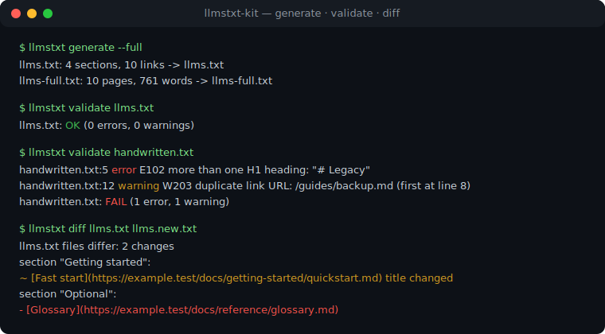
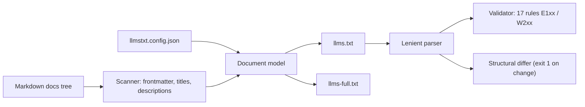

# llmstxt-kit

[English](README.md) | [中文](README.zh.md) | [日本語](README.ja.md)

[](LICENSE)   [](CONTRIBUTING.md)

**面向 llms.txt 规范的开源工具链——从任意 Markdown 文档树生成、校验（lint）并对比（diff）llms.txt 与 llms-full.txt，完全离线、零依赖。**



```bash
# not yet on npm — install from a checkout of this repository
npm install && npm run build && npm pack
npm install -g ./llmstxt-kit-0.1.0.tgz
```

## 为什么选择 llmstxt-kit？

[llms.txt](https://llmstxt.org/) 正在成为 AI 时代的 robots.txt：放在站点根目录的一份 Markdown 索引，告诉 LLM 爬虫你的文档包含什么、全文在哪里。现有工具大多只覆盖工作流的一个角落——参考实现 `llms_txt2ctx` 只*消费* llms.txt 而不生成它，框架插件只能在自己的构建流程里生成（VitePress、Docusaurus），托管式生成器则要凭 API key 爬取你渲染后的站点。它们都不会替你检查上季度手写的那份文件，也不会在部署前告诉你到底改了什么。llmstxt-kit 把 llms.txt 当作构建产物，提供完整的本地工具链：从你已有的 Markdown **生成**，用 17 条带稳定编号、精确到行号的规则**校验**，并对两个版本做结构化**对比**，让 CI 像评审代码一样评审索引变更。

|  | llmstxt-kit | llms_txt2ctx | vitepress-plugin-llms | Firecrawl 生成器 |
|---|---|---|---|---|
| 输入 | 任意 Markdown 树 | 已有的 llms.txt | 仅限 VitePress 项目 | 在线爬取你的站点 |
| 生成 llms.txt / llms-full.txt | 是 / 是 | 否 | 是 / 是 | 是 / 是 |
| 校验 llms.txt（行级规则） | 17 条规则 | 否 | 否 | 否 |
| 面向 CI 的结构化 diff | 是 | 否 | 否 | 否 |
| 离线可用 | 是 | 是 | 是 | 否（API + 额度） |
| 运行时依赖 | 0 | Python + fastcore | VitePress 工具链 | 托管服务 |

<sub>各项依赖与能力说明均对照各项目公开文档核实，2026-07。</sub>

## 功能特性

- **三个动词，一个二进制** —— `generate`、`validate`、`diff` 共享同一个解析器和文档模型，linter 永远与生成器保持一致。
- **任意 Markdown 树皆可输入** —— 不绑定任何框架：直接指向你已有的 `docs/`；frontmatter（`title`、`description`、`section`、`order`、`optional`、`draft`）可以细化结果，但没有任何字段是必需的。
- **17 条带稳定编号的 lint 规则** —— 违反规范是错误（E101–E108），质量问题是警告（W201–W209）；编号含义永不变更，脚本可以直接匹配。
- **结构化而非文本化的 diff** —— 两份文件中的链接按 URL 匹配；纯排版调整不产生噪音，真实变更每条一行带前缀，退出码 1 天然适配 CI。
- **确定性且诚实的输出** —— 相同的树 + 相同的配置产出逐字节一致的文件，且每份生成的文件都能以零告警通过自带校验器（由测试强制保证）。
- **零运行时依赖，完全离线** —— 只需要 Node.js；工具从不打开任何 socket，`typescript` 是唯一的 devDependency。

## 快速上手

安装：

```bash
# not yet on npm — install from a checkout of this repository
npm install && npm run build && npm pack
npm install -g ./llmstxt-kit-0.1.0.tgz
```

对仓库自带的示例文档树进行生成与校验：

```bash
# from the root of your checkout
cd examples
llmstxt generate --full
llmstxt validate llms.txt
```

输出（真实运行结果）：

```text
llms.txt: 4 sections, 10 links -> llms.txt
llms-full.txt: 10 pages, 761 words -> llms-full.txt
llms.txt: OK (0 errors, 0 warnings)
```

生成的 `llms.txt` 开头几行：

```text
# Brewlog

> A self-hosted coffee-brewing journal — every brew logged, charted and kept on your own machine.

## Getting started

- [Installation](https://example.test/docs/getting-started/installation.md): Brewlog ships as a single binary with no external services. Download the release for your platform, place it on your PATH, and you are done.
- [Quickstart](https://example.test/docs/getting-started/quickstart.md): Log your first brew in under two minutes.
```

接着重命名一个页面、删除另一个，重新生成，就能看到这次部署到底会改动什么（真实运行结果）：

```bash
# simulate the next deploy: rename one page's H1, delete another page
sed -i.bak 's/^# Quickstart$/# Fast start/' docs/getting-started/quickstart.md
rm docs/reference/glossary.md
llmstxt generate --out llms.new.txt --quiet
llmstxt diff llms.txt llms.new.txt
```

```text
llms.txt files differ: 2 changes
section "Getting started":
  ~ [Fast start](https://example.test/docs/getting-started/quickstart.md) title changed
section "Optional":
  - [Glossary](https://example.test/docs/reference/glossary.md)
```

`diff` 在有变更时以退出码 1 结束，两行 CI 步骤即可要求 llms.txt 的更新必须经过评审。更多场景见 [examples/](examples/README.md)。

## Lint 规则

错误（E1xx）违反 llms.txt 结构；警告（W2xx）是质量问题，仅在 `--strict` 下导致失败。每条规则的完整说明见 [docs/rules.md](docs/rules.md)。

| 规则 | 级别 | 检查内容 |
|---|---|---|
| E101–E104 | error | 有且仅有一个 H1、位于文件开头、不出现 H3 及更深标题 |
| E105–E106 | error | 章节条目必须是 `- [title](url)` 链接，标题与 URL 非空 |
| E107–E108 | error | 章节名唯一；文件非空 |
| W201, W207 | warning | 摘要引用块存在且紧跟在 H1 之下 |
| W202, W208 | warning | 章节内是链接，而不是散文或空壳 |
| W203, W205, W206 | warning | 无重复 URL、无非 http(s) 协议、无空描述 |
| W204 | warning | `Optional` 章节位于最后（上下文截断从这里开始） |
| W209 | warning | 文件以换行符结尾 |

## 配置

工作目录下的 `llmstxt.config.json` 会被自动读取（`--config` 可覆盖路径；命令行参数优先于文件值）。未知键和类型错误都是硬错误——拼写失误不可能悄悄产出一份错误的索引。

| 键 | 默认值 | 作用 |
|---|---|---|
| `name` | 根 index 的 H1 | 站点名称（H1） |
| `summary` | 根 index 的第一段 | 引用块摘要 |
| `baseUrl` | `""`（根相对路径） | 所有链接 URL 的前缀 |
| `docsDir` | `docs` | 要扫描的文档根目录 |
| `urlStyle` | `md` | `md` 保留 `.md`，`clean` 去掉扩展名，`html` 映射为 `.html` |
| `rootSection` | `Documentation` | 位于文档根目录下页面的章节名 |
| `sections` | `{}` | 重命名顶层目录，如 `{"api": "API reference"}` |
| `sectionOrder` | `[]` | 固定章节顺序；其余按字母序排列 |
| `optional` | `[]` | 匹配的 glob 归入 `Optional` 章节 |
| `exclude` | `[]` | 匹配的 glob 整体剔除 |
| `maxDescriptionLength` | `160` | 自动推导描述的截断长度 |

所有子命令共享同一套退出码：`0` 正常，`1` lint 错误或 diff 有变更，`2` 用法/配置/IO 错误——脚本因此能区分"文件有问题"和"调用方式有问题"。

## 架构



## 路线图

- [x] 生成器（llms.txt + llms-full.txt）、17 条规则的校验器、结构化 diff、严格配置加载、JSON 输出（v0.1.0）
- [ ] `check` 命令：生成 + 对比一步完成，作为一行式 CI 关卡
- [ ] `--fix` 自动修复可纠正的问题（末尾换行、冒号清理）
- [ ] 支持 MDX 输入与标题锚点链接
- [ ] 支持 sitemap.xml / URL 列表输入，覆盖非 Markdown 站点

完整列表见 [open issues](https://github.com/JaydenCJ/llmstxt-kit/issues)。

## 参与贡献

欢迎贡献。先 `npm install && npm run build` 构建，再运行 `npm test` 和 `bash scripts/smoke.sh`（必须打印 `SMOKE OK`）——本仓库不附带 CI，以上所有承诺均由本地运行验证。参见 [CONTRIBUTING.md](CONTRIBUTING.md)，挑一个 [good first issue](https://github.com/JaydenCJ/llmstxt-kit/issues?q=is%3Aissue+is%3Aopen+label%3A%22good+first+issue%22)，或发起一个 [discussion](https://github.com/JaydenCJ/llmstxt-kit/discussions)。

## 许可证

[MIT](LICENSE)
